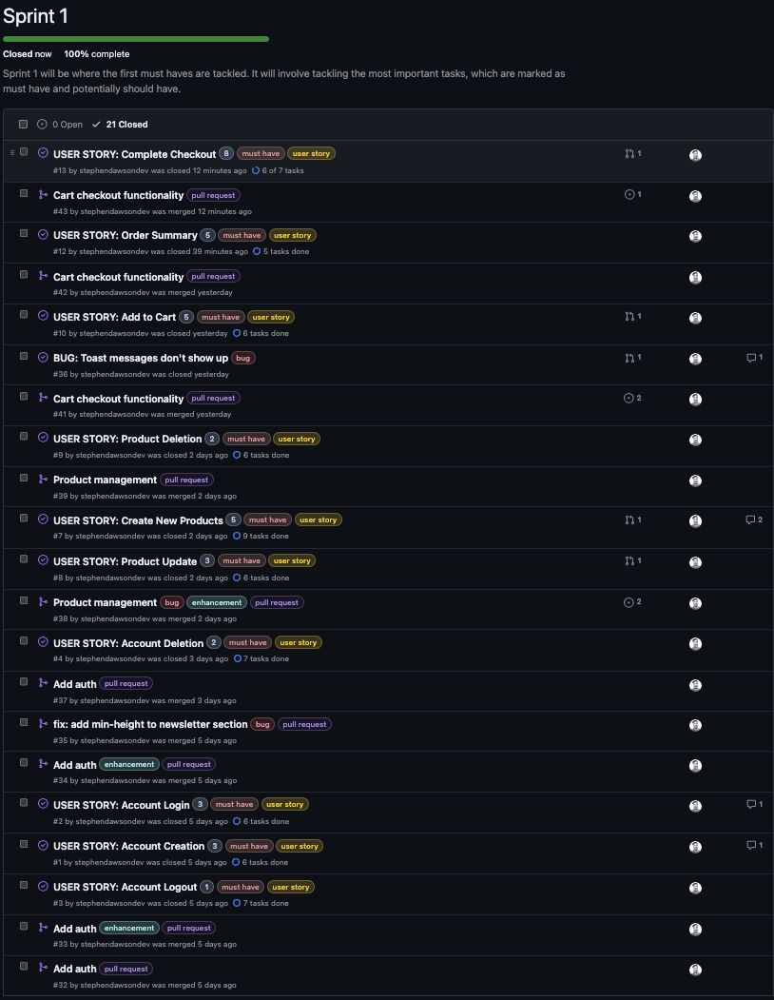
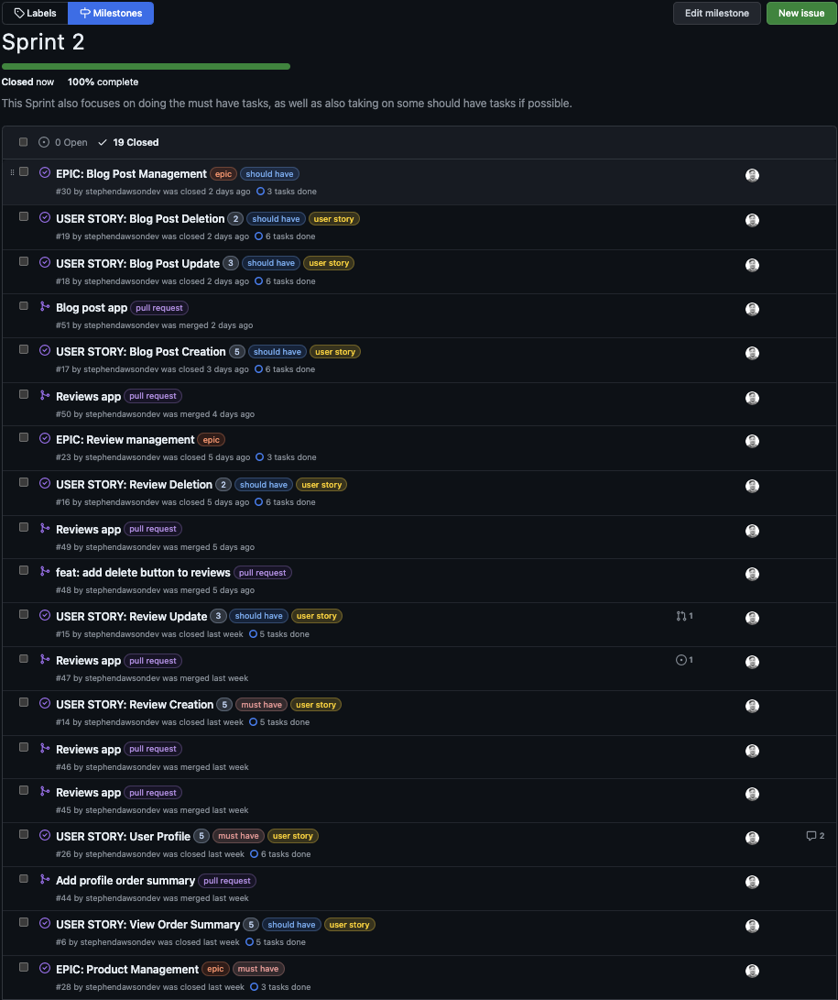
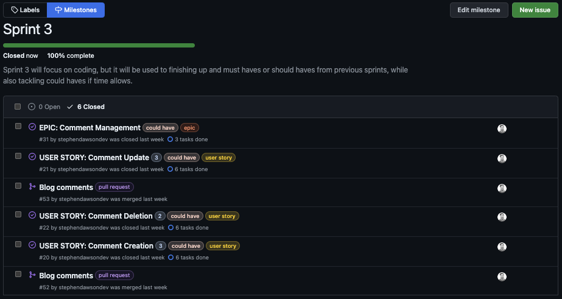
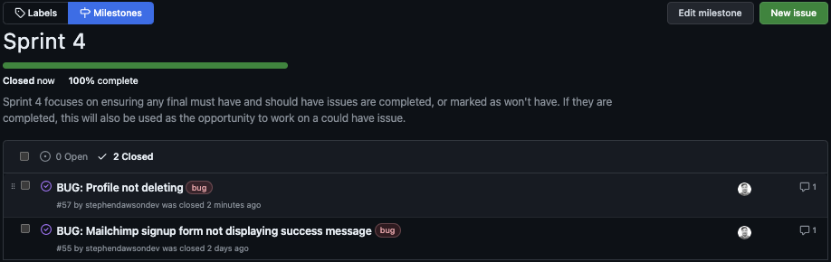
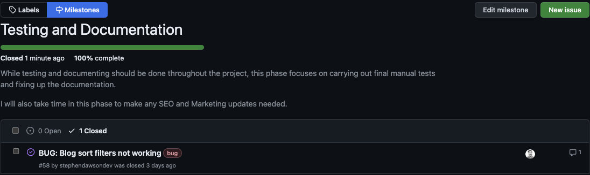

# Agile Methodology

[Click here to go back to the README.md file](README.md)

## Overview

For my project, I am using a Github Project board. I'm utilising Github's milestones to track my progress, as well as their `.yml` issue templates for creating templates for Bugs, User stories and Epics. I have also set up simple workflows that will automatically move issues to the appropriate columns as they are created and closed.

## Table of contents

- [Agile Tools](#agile-tools)
  - [Project Board](#project-board)
  - [Milestones](#milestones)
  - [Issues](#issues)
  - [Labels](#labels)
  - [Story Points](#story-points)
  - [Workflows](#workflows)
  - [Project Statuses](#project-statuses)
- [Sprints - Notes and learnings](#sprints---notes-and-learnings)
  - [Sprint 1 notes](#sprint-1-notes)
  - [Sprint 2 notes](#sprint-2-notes)
  - [Sprint 3 notes](#sprint-3-notes)
  - [Sprint 4 notes](#sprint-4-notes)
  - [Testing and Documentation phase notes](#testing-and-documentation-phase-notes)

## Agile Tools

### Project Board

The project board is split into 4 columns:

- Backlog
- To Do
- In Progress
- Done

The backlog column is where I store all of my issues that I have created. I then move them into the To Do column when I am ready to start working on them. Once I have started working on them, I will move them into the In Progress column. Once I have completed the issue, I will move it into the Done column.

### Milestones

I decided to break down the project into milestones. I have created 5 milestones, which are:

- Sprint 1 (One week)
- Sprint 2 (One week)
- Sprint 3 (One week)
- Sprint 4 (One week)
- Testing and Development Phase (Two weeks)

### Issues

I created three issue templates, which are:

- Bug
- User Story
- Epic

I created the templates as `.yml` files so that it takes advantage of Github's [issue forms](https://docs.github.com/en/communities/using-templates-to-encourage-useful-issues-and-pull-requests/about-issue-and-pull-request-templates) feature. One great advantage of `.yml` templates is that you can automatically add the issue to a project board, which isn't possible with `.md` templates.

###  Labels

I utilised some existing labels and created a few labels to help me organise my issues. The labels I used are:

- `bug` (existing) - Used to identify bugs
- `duplicate` (existing) - Used to identify duplicate issues
- `enhancement` (existing) - Used to identify enhancements
- `user story` (custom) - Used to identify user stories
- `epic` (custom) - Used to identify epics
- `must have` (custom) - Used to identify must have issues
- `should have` (custom) - Used to identify should have issues
- `could have` (custom) - Used to identify could have issues
- `won't have` (custom) - Used to identify won't have issues
- `pull request` (custom) - Used to more easily identify pull requests on the project board

### Story Points

Since they helped with estimations in a previous project, I decided to use story points to help me in this project too to estimate how long an issue will take to complete. I used the Fibonacci sequence to help me estimate the story points. I used the following story points:

- 1
- 2
- 3
- 5
- 8
- 13

### Workflows

I enabled three of the set workflows on the project (two were already enabled):

- [Automatically add project cards to the backlog column](./documentation/workflows/workflow1.png)

- [Automatically move project cards to the done column when issues are closed](./documentation/workflows/workflow2.png)

- [Automatically add any reopened issues to the Todo column](./documentation/workflows/workflow3.png)

### Project Statuses

I used the new [GitHub Project Statuses](https://github.com/users/stephendawsondev/projects/6/views/1?pane=info&statusUpdateId=2286) feature to add updates to my project board on how the project was going.

## Sprints - Notes and learnings

### Sprint 1 notes

> "Sprint 1 will be where the first must haves are tackled. It will involve tackling the most important tasks, which are marked as must have and potentially should have."

This was my first Sprint and I was cautious about the number of issues I thought I would be able to do. As it turns out, I was able to get complete a lot more than I had originally intended. For Sprint 2, I will adjust the story points and number of issues I think I can complete. Here are some notes on this sprint:

1. The initial setup took longer than I anticipated. I knew that I wanted to use Bootstrap with my colour scheme, so it took some time to figure out how to override the default Bootstrap class colours. In the end, I was able to do it using SCSS. Because of using SCSS, I also ran into some issues with my deploy, because I needed to add the Node.js buildpack.
2. I started with the Account Management Epic. Since I used `django-allauth`, I was able to get a lot of the functionality more easily than I though. I also didn't deviate from the basic functionality, so I was able to complete it quickly. On the other hand, I wasn't able to finish the Profile stories within the Account Management Epic. While I could add the form, the order summary came much later, so I couldn't close it off until that was added.
3. I was able to complete the Product Management Epic. I was able to add the product list and product detail pages. I also added the product management page, which was a should have.
4. I was able to complete the Cart Management Epic. I was able to add the cart page and the cart management page. I also added the order summary page, but it was at the end. If I had more time, I would have gone back and done the Account Management tasks, but those will be pushed to Sprint 2.
5. I also started using `feat:`, `fix:`, `docs:`, `style:` and `task:` in my commit messages, which is something I hadn't adopted in previous projects. I missed some near the beginning, but I'll be using them moving forward.

### Sprint 2 notes

> "This Sprint also focuses on doing the must have tasks, as well as also taking on some should have tasks if possible."

I made good progress with Sprint 2, starting with finishing off the Account Management Epics. I also got ot added the **Reviews** functionality so that a user can add, update or delete a review on a product page. Additionally, other registered users can like a review, so the review score increases based on the numberof likes.

On of the big challenges I had with my **Reviews** was related to migrations. I had already migrated some reviews, but then realised I needed to add or update some fields. When I did that, it broke my migrations. Luckily, I was able to resolve the issue and learned a lot about migrations in the process.

In Sprint 2, I also completed the blog posts part of my **Blog** app. I was able to add the blog list and blog detail pages. I also added the blog management page, which allows a staff member to add a blog post.

Between the main tasks, I also made some small UI/UX improvement on the site, which allowed me to visualise the larger tasks better.

### Sprint 3 notes

> "Sprint 3 will focus on coding, but it will be used to finishing up and must haves or should haves from previous sprints, while also tackling could haves if time allows."

In Sprint 3, I had a friend visiting and didn't have much time to dedicate to the project, but that was predicted and I got what I needed to get done finished. I completed the Blog and Comment User stories and Epics. I still have some final touches to do, but I will do that in Sprint 4.

### Sprint 4 notes

> Sprint 4 focuses on ensuring any final must have and should have issues are completed, or marked as won't have. If they are completed, this will also be used as the opportunity to work on a could have issue.

In Sprint 4, I had already finished the implementation of all the core tasks. I spent most of the time going through the project and making sure there were no significant bugs. I carried out some minor UI changes and reported three of the bigger bugs I found. I was able to resolve 2 of the bugs during the sprint, but the final bug I have added as a future feature. It turns out that it would have required quite some restructuring to fix it, so I decided to leave it for now.

### Testing and Documentation phase notes

> While testing and documenting should be done throughout the project, this phase focuses on carrying out final manual tests and fixing up the documentation.

I spent this sprint going though the site and testing its functionality. I also went through the code and made sure it was well documented. I also added some final touches to the site, such asa 500 error page. I found some small UI/UX improvements that I fixed and also one larger bug with the filters that I added to the project board and fixed.

