# Sleep Healthily

Sleep Healthily is a modern E-Commerce website that sells products to help you have a good night's sleep. The site has 6 main products, but staff members can also add more products to the range for customers to purchase. You can [click here to see the deployed Sleep Healthily site on Heroku](https://sleep-healthily-12a12155ea31.herokuapp.com/).

<!-- multidevice mockup image, centred width 100% -->
<p align="center">
  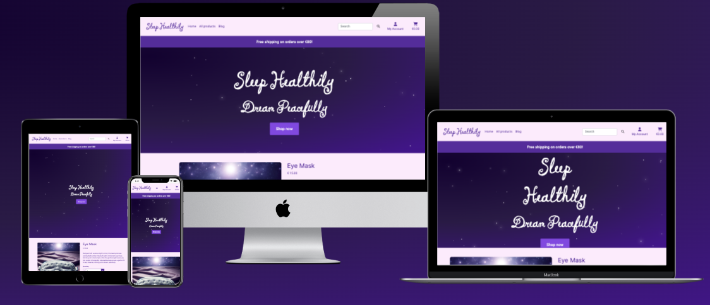
</p>

## Table of Contents

1. [Planning and Design](#planning-and-design)

   - [Site objective](#site-objective)
   - [Opportunities](#opportunities)
   - [Scope](#scope)
   - [User stories and Epics](#user-stories-and-epics)
   - [Wireframes](#wireframes)
   - [Colours and Fonts](#colours-and-fonts)
   - [User flowchart](#user-flowchart)

2. [Development](#development)

   - [Site Features](#site-features)
   - [Entity Relationship Diagram](#entity-relationship-diagram)
   - [Models](#models)

3. [Business Model](#business-model)

   - [Search Engine Optimisation (SEO) and Marketing](#search-engine-optimisation-seo-and-marketing)
   - [Technologies used](#technologies-used)

4. [Deployment](#deployment)

   - [ElephantSQL Database](#elephantsql-database)
   - [Amazon AWS](#amazon-aws)
   - [Heroku](#heroku)

5. [Testing and Agile notes](#testing-and-agile-notes)

   - [Testing documentation](#testing-documentation)
   - [Agile notes](#agile-notes)

6. [Credits](#credits)

   - [Assets](#assets)
   - [Content](#content)
   - [Hostng and Deployment](#hosting-and-deployment)
   - [Acknowledgements](#acknowledgements)

## Planning and Design

###  Site objective

The objective of the site is to provide a modern and easy to use E-Commerce platform for customers to purchase products to help them have a good night's sleep. The site also has a blog, where staff members can create content to help customers with sleep tips and advice. The site also has a newsletter signup form, which can be used to collect emails for marketing purposes.

###  Opportunities

I have listed the features users will want and need in the table below, rating them by their importance and difficulty. The rating system is based on the MoSCoW method of prioritisation.

| Feature                                    | Importance | Difficulty | Project priority |
| ------------------------------------------ | ---------- | ---------- | ---------------- |
| **Account Features**                       |            |            |                  |
| Account login                              | 4          | 1          | Must have        |
| Account logout                             | 4          | 1          | Must have        |
| Account creation                           | 4          | 1          | Must have        |
| Account deletion                           | 4          | 1          | Must have        |
| Account/Profile update                     | 4          | 2          | Must have        |
| User profile                               | 4          | 3          | Must have        |
| **User Features (Registered customer)**    |            |            |                  |
| Summary of orders                          | 3          | 3          | Should have      |
| Product wishlist                           | 1          | 4          | Won't have       |
| **Product Features (Staff)**               |            |            |                  |
| Product creation                           | 5          | 3          | Must have        |
| Product update                             | 5          | 3          | Must have        |
| Product deletion                           | 5          | 3          | Must have        |
| **Cart/Checkout features**                 |            |            |                  |
| Add product to cart                        | 5          | 3          | Must have        |
| Remove product from cart                   | 5          | 2          | Must have        |
| See order summary                          | 5          | 2          | Must have        |
| Pay and complete checkout                  | 5          | 3          | Must have        |
| **Review Features (Registered customer)**  |            |            |                  |
| Review creation                            | 3          | 3          | Must have        |
| Review update                              | 2          | 3          | Should have      |
| Review deletion                            | 2          | 3          | Should have      |
| **Blog Post Features (Staff)**             |            |            |                  |
| Blog post creation                         | 2          | 3          | Should have      |
| Blog post update                           | 2          | 3          | Should have      |
| Blog post deletion                         | 2          | 3          | Should have      |
| **Comment Features (Registered customer)** |            |            |                  |
| Comment creation                           | 1          | 3          | Could have       |
| Comment update                             | 1          | 3          | Could have       |
| Comment deletion                           | 1          | 3          | Could have       |

<details>
  <summary>Click here to expand the priority descriptions and percentages</summary>

| Priority    | Percentage | Description                                                                                                                                                            |
| ----------- | ---------- | ---------------------------------------------------------------------------------------------------------------------------------------------------------------------- |
| Must have   | 59%        | These are the features that are essential for the site to be usable. If any of these features are missing, the site will not be usable.                                |
| Should have | 25%        | These are the features that are important, but not essential. If any of these features are missing, the site will still be usable.                                     |
| Could have  | 12%        | These are the features that are nice to have, but not essential. If any of these features are missing, the site will still be usable.                                  |
| Won't have  | 4%         | These are the features that are not essential and will not be implemented in the current project. If any of these features are missing, the site will still be usable. |

</details>

### Scope

### User stories and Epics

#### Account Features

- As a **user**, I can **create an account** so that I can **access personalised features and save my preferences**.
- As a **user**, I can **log into my account** so that I can **access my personal settings and history, or prefill my details at checkout**.
- As a **user**, I can **log out of my account** so that I can **ensure my account is secure when I'm not using it**.
- As a **user**, I can **update my account/profile** so that I can **keep my personal information up to date for checking out**.
- As a **user**, I can **delete my account** so that I can **remove my personal data from the platform**.
- As a **user**, I can **access and view my user profile** so that I can **see my personal information, order history, and manage my account settings**.

#### User Features (Registered Customer)

- As a **registered customer**, I can **view a summary of my orders** so that I can **keep track of my purchases**.
- As a **user**, I want to **add products to a wishlist** so that I can **save them for future consideration or purchase**.

#### Product Features (Staff)

- As a **staff member**, I can **create new products** so that I can **offer more choices to customers**.
- As a **staff member**, I can **update product details** so that I can **ensure all information about the products is current and accurate**.
- As a **staff member**, I can **delete products** so that I can **remove items that are no longer available or relevant**.

#### Cart/Checkout Features

- As a **customer**, I can **add products to my cart** so that I can **purchase them**.
- As a **customer**, I can **remove products from my cart** so that I can **manage items before finalizing my purchase**.
- As a **customer**, I can **see an order summary in the cart** so that I can **review my order before completing the purchase**.
- As a **customer**, I can **complete the checkout process and pay** so that I can **finalize my order**.

#### Review Features (Registered Customer)

- As a **registered customer**, I can **create reviews for products** so that I can **share my experience with others**.
- As a **registered customer**, I can **update my reviews** so that I can **modify my feedback if my opinion changes**.
- As a **registered customer**, I can **delete my reviews** so that I can **remove my feedback if I no longer wish it to be displayed**.

#### Blog Post Features (Staff)

- As a **staff member**, I can **create blog posts** so that I can **provide valuable content to customers and visitors**.
- As a **staff member**, I can **update blog posts** so that I can **keep the content current and relevant**.
- As a **staff member**, I can **delete blog posts** so that I can **remove outdated or irrelevant content**.

#### Comment Features (Registered Customer)

- As a **registered customer**, I can **create comments on blog posts** so that I can **engage in discussions and share my thoughts**.
- As a **registered customer**, I can **update my comments** so that I can **change my input or correct mistakes**.
- As a **registered customer**, I can **delete my comments** so that I can **remove my input if I change my mind**.

###  Wireframes

I have created wireframes for the main pages of the site. I have used [Figma](https://figma.com) to create the wireframes. Here are the wireframes for the main pages:

<details>
  <summary>Homepage - Desktop (click to expand)</summary>


</details>

<details>
  <summary>Homepage - Mobile (click to expand)</summary>


</details>
<br>
<details>
  <summary>Blog List Page - Desktop (click to expand)</summary>


</details>

<details>
  <summary>Blog List Page - Mobile (click to expand)</summary>


</details>

<br>
<details>
  <summary>Blog Post Page - Desktop (click to expand)</summary>


</details>

<details>
  <summary>Blog Post Page - Mobile (click to expand)</summary>


</details>

<br>
<details>
  <summary>Cart Page - Desktop (click to expand)</summary>


</details>

<details>
  <summary>Cart Page - Mobile (click to expand)</summary>


</details>

<br>
<details>
  <summary>Checkout Page - Desktop (click to expand)</summary>


</details>

<details>
  <summary>Checkout Page - Mobile (click to expand)</summary>


</details>

<br>
<details>
  <summary>Collection Page - Desktop (click to expand)</summary>


</details>

<details>
  <summary>Collection Page - Mobile (click to expand)</summary>


</details>

<br>
<details>
  <summary>Featured Blog Posts - Desktop (click to expand)</summary>


</details>

<details>
  <summary>Featured Blog Posts - Mobile (click to expand)</summary>


</details>

<br>
<details>
  <summary>Order Summary Page - Desktop (click to expand)</summary>


</details>

<details>
  <summary>Order Summary Page - Mobile (click to expand)</summary>


</details>

<br>
<details>
  <summary>Product Page - Desktop (click to expand)</summary>


</details>

<details>
  <summary>Product Page - Mobile (click to expand)</summary>


</details>

<br>
<details>
  <summary>Profile Page - Desktop (click to expand)</summary>


</details>

<details>
  <summary>Profile Page - Mobile (click to expand)</summary>


</details>

### Colours and Fonts

#### Colours

The colours used on the site are:

- #572b9e - (Primary)
- #ffeafd - (Background light, text light)
- #8546e5 - (Secondary)
- #653d73 - (Background dark)
- #7a0ea0 - (Accent)

Here is a screenshot of the palette from Cooolors:


#### Fonts

**Ingrid Darling** is chosen as the main title font for its elegant and inviting appearance. It embodies a sense of comfort and tranquility, which is perfectly suited for a sleepy theme. It sets a calming tone right from the first glance to encourage rest and relaxation.

**Inter** is used for headings. It is a highly readable typeface designed specifically for user interfaces. Its clean and neutral design ensures that headings are clear and easy to navigate, enhancing the usability of the site.Inter allows for a balance between aesthetic appeal and clarity.

I selected **Roboto** for body text because is a versatile and modern font that has great legibility. Longer texts such as product descriptions and user guides are easy to read and digest, which is important since there will be a blog on the site. Roboto's straightforward style supports the overall clean and user-focused design, making it an ideal choice for the body text.

### User flowchart

The user flowchart was created using [Draw.io](https://app.diagrams.net/). The flowchart shows the different paths that a user can take through the site.


## Development

### Site Features

Below are the features of the site, organized by page. Click on each summary to view the associated images.

<details>
  <summary>Homepage (click to expand)</summary>

The homepage is the first page that users see when they visit the site. It has a hero section with a call to action and a featured product section. The hero section has a starry sky background and a call to action to shop now. The featured product section shows the first available product.

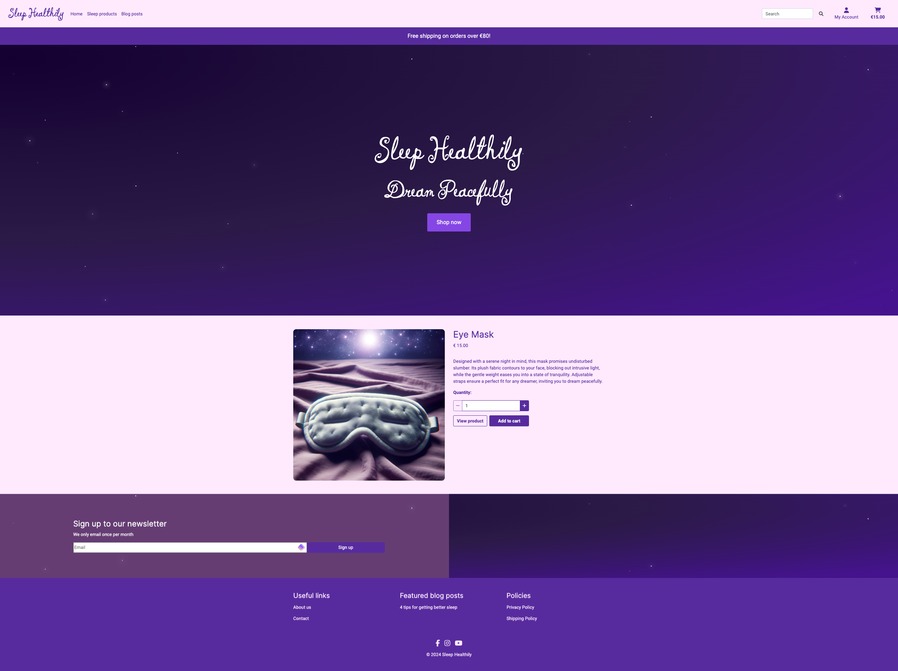

</details>

<br>

<details>
  <summary>Blog Post Create (click to expand)</summary>

The blog post create page is where staff members can create new blog posts. It has a form with fields for the title, content, published state, the blog categories, tags and an image. The form has a submit button to create the blog post.

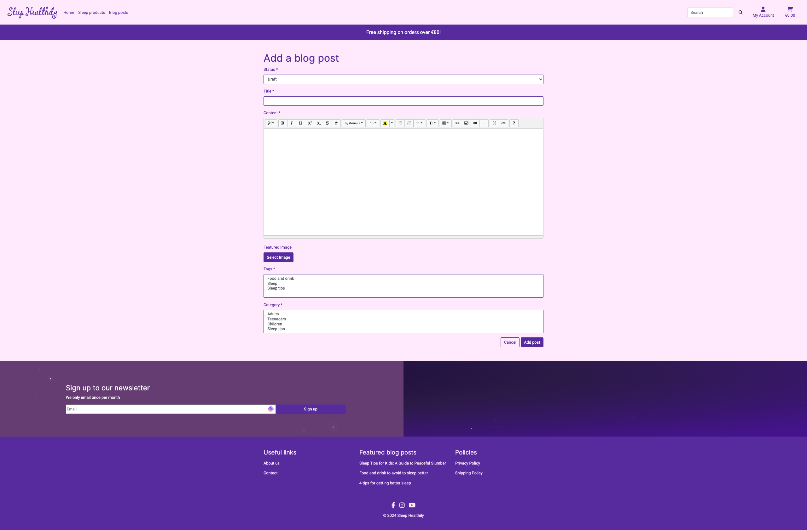

</details>

<br>

<details>
  <summary>Blog Post Edit (click to expand)</summary>

The blog post edit page is where staff members can update existing blog posts.

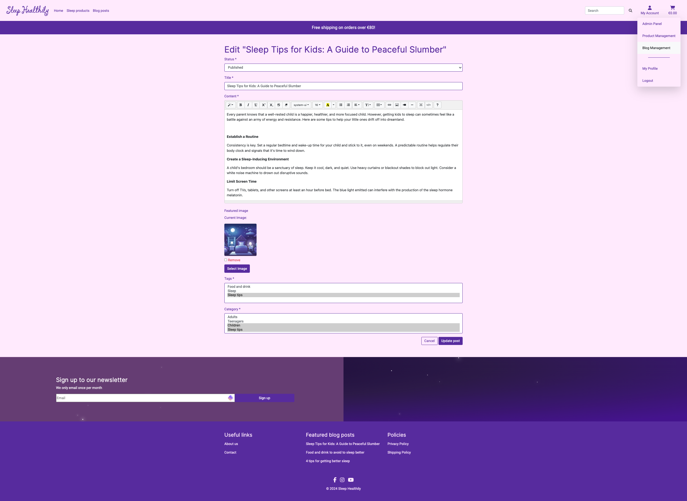

</details>

<br>

<details>
  <summary>Blog Post Detail (click to expand)</summary>

The blog post detail page shows the full content of a blog post. It has the title, content, author, published date, and comments. The page also has a form to add a comment to the blog post.

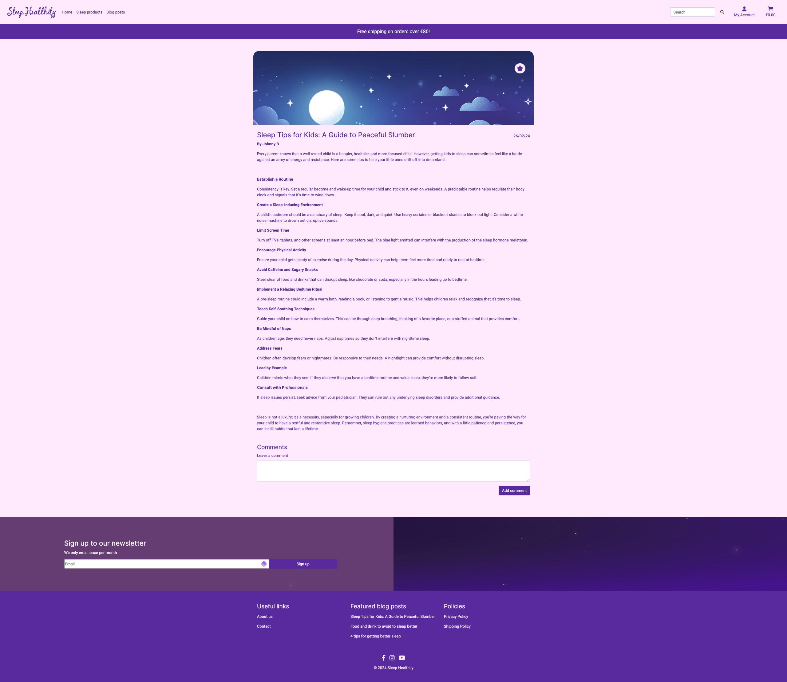

</details>

<br>

<details>
  <summary>About Us (click to expand)</summary>

The about us page has a section about the company.

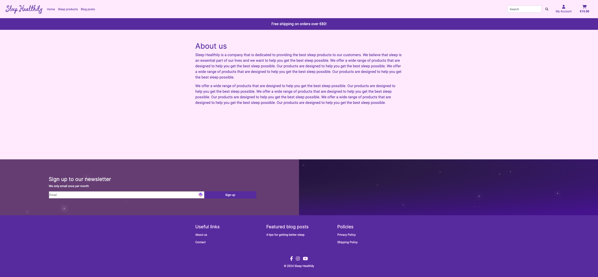

</details>

<br>

<details>
  <summary>Blog Posts (click to expand)</summary>

The blog posts page shows a list of all blog posts. Each blog post has a title, published date, and a summary of the content. The page also has a filters to sort the posts by name.

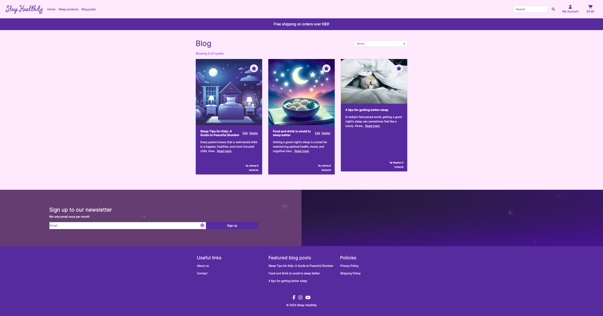

</details>

<br>

<details>
  <summary>Cart (click to expand)</summary>

The cart page shows a list of all products in the cart. Each product has a name, price, quantity, and total price. The page also has a form to update the quantity of each product and a button to remove the product from the cart.

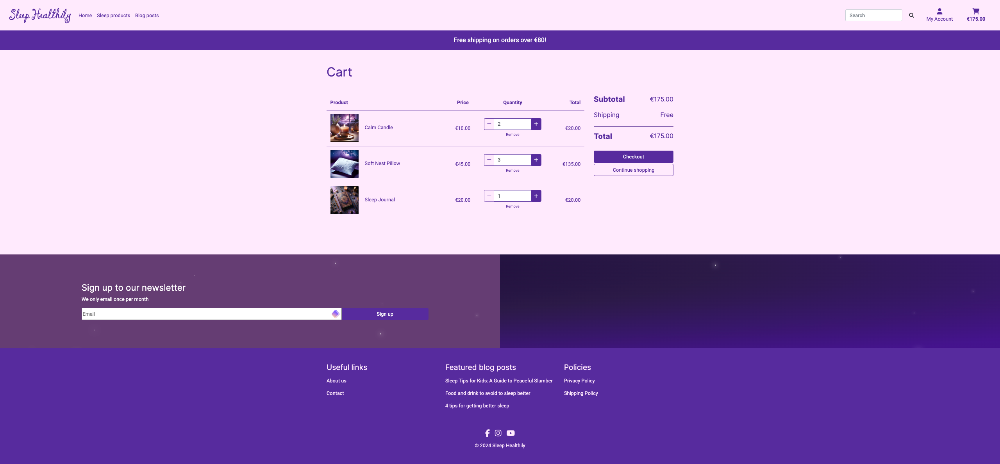

</details>

<br>

<details>
  <summary>Checkout (click to expand)</summary>

The checkout page has a form to enter the shipping details and a button to complete the order. The page also has a summary of the order with the products, subtotal, shipping, and total price.

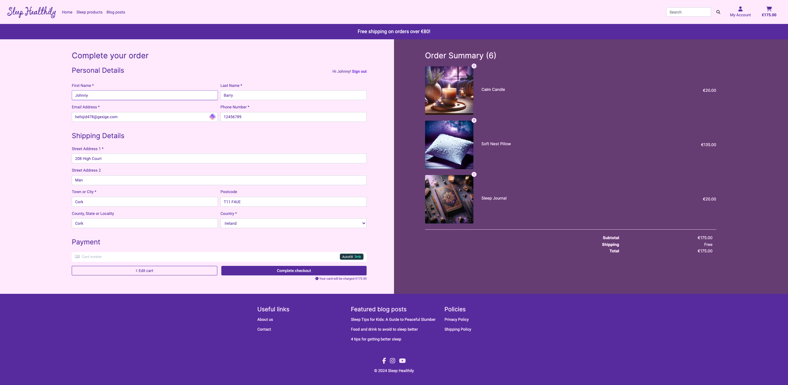

</details>

<br>

<details>
  <summary>Order Summary (click to expand)</summary>

The order summary page shows a summary of the order with the products, subtotal, shipping, and total price.

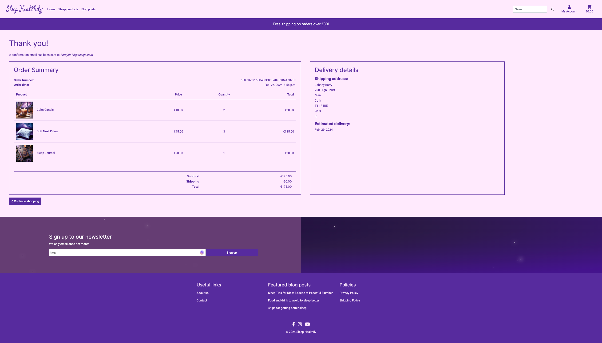

</details>

<br>

<details>
  <summary>Product Add (click to expand)</summary>

The product add page is where staff members can create new products. It has a form with fields for the name, description, price, quantity, and an image. The form has a submit button to create the product.

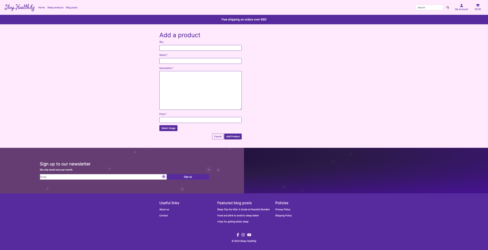

</details>

<br>

<details>
  <summary>Product Page (click to expand)</summary>

The product page shows the full details of a product. It has the name, description, price, quantity, and an image. The page also has a form to add the product to the cart. Product reviews are also display on this page and customers who have purchased the product can leave a review for it.

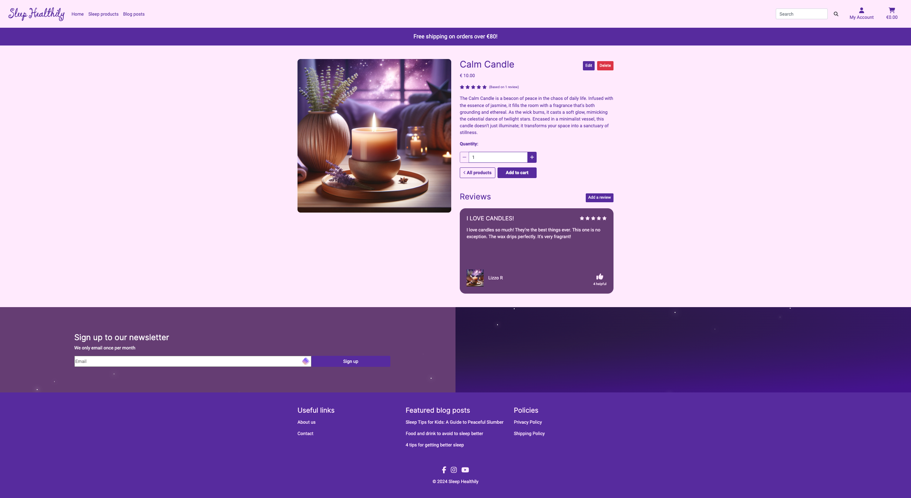

</details>

<br>

<details>
  <summary>Products Page (click to expand)</summary>

The products page shows a list of all products. Each product has a name, price, and an image. The page also has a filters to sort the products by name, price or review rating. The page also has a search bar to search for products by name or description.

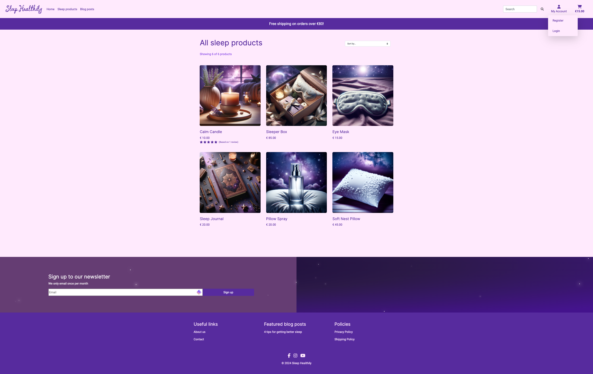

</details>

<br>

<details>
  <summary>Product Search (click to expand)</summary>

The product search page shows a list of products that match the search query. Each product has a name, price, and an image. The page also has a filters to sort the products by name, price or review rating.

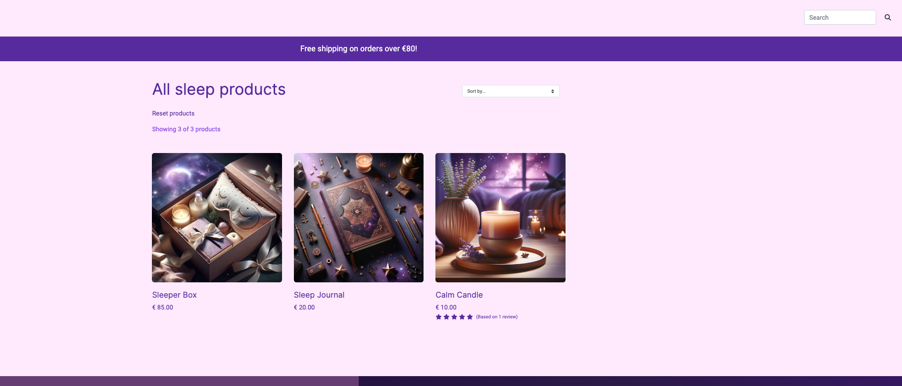

</details>

<br>

<details>
  <summary>Profile Page (click to expand)</summary>

The profile page shows the user's personal information and order history. The page also has a form to update the user's personal information. The user can also see any blog posts they have favourited, and if they are a staff member, they can approve comments on their blog posts.

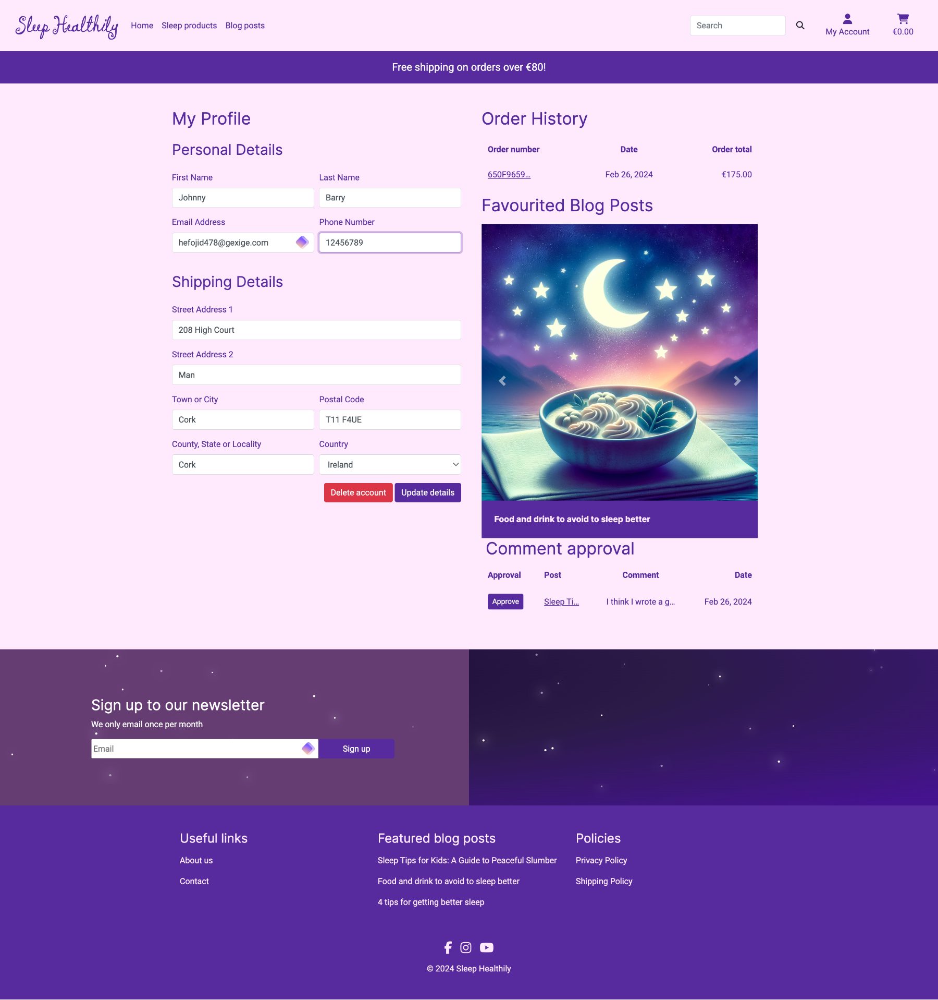

</details>

<br>

<details>
  <summary>Privacy Policy (click to expand)</summary>

The privacy policy page has a section about the privacy policy.

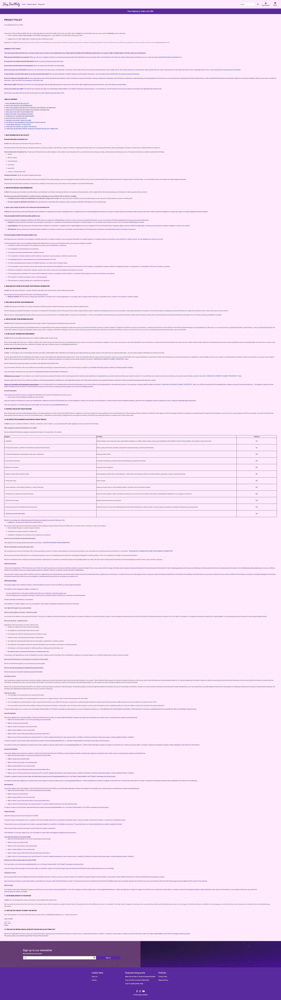

</details>

<br>

<details>
  <summary>Shipping Policy (click to expand)</summary>

The shipping policy page has a section about the shipping policy.

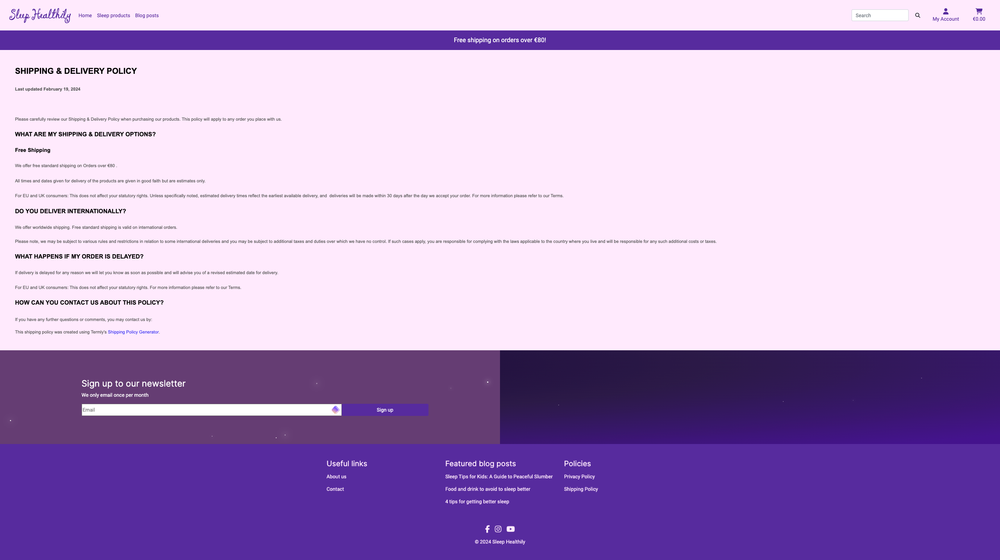

</details>

### Entity Relationship Diagram

The Entity Relationship Diagram (ERD) was created using [Draw.io](https://app.diagrams.net/). The ERD is a visual representation of the database structure. It shows the tables, the columns in each table, and the relationships between the tables. Here is the ERD from my planning:

<details>
  <summary>Click here to view the planning ERD</summary>


</details>

<details>
  <summary>Click here to view the final ERD</summary>

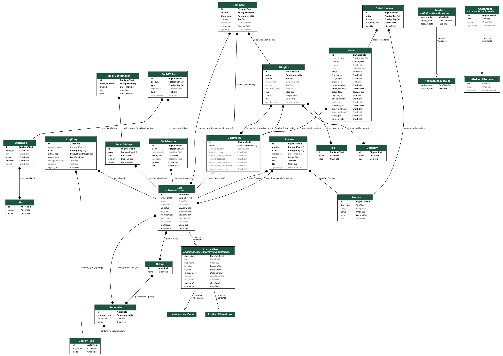

</details>

### Models

I created a number of models for my project. I used allauth's models for authentication. Here are the other models and their fields:

#### UserProfile

| **PK** | **id** (unique)         | Type         | Notes                |
| ------ | ----------------------- | ------------ | -------------------- |
| **FK** | user                    | OneToOne     | FK to **User** model |
|        | default_phone_number    | CharField    |                      |
|        | default_street_address1 | CharField    |                      |
|        | default_street_address2 | CharField    |                      |
|        | default_town_or_city    | CharField    |                      |
|        | default_county          | CharField    |                      |
|        | default_postcode        | CharField    |                      |
|        | default_country         | CountryField |                      |

#### BlogPost

| **PK**  | **id** (unique) | Type          | Notes                        |
| ------- | --------------- | ------------- | ---------------------------- |
| **FK**  | author          | ForeignKey    | FK to **UserProfile** model  |
|         | title           | CharField     | Unique                       |
|         | slug            | SlugField     | Unique                       |
|         | content         | TextField     |                              |
|         | excerpt         | TextField     |                              |
| **M2M** | tags            | ManyToMany    | M2M to **Tag** model         |
| **M2M** | category        | ManyToMany    | M2M to **Category** model    |
| **M2M** | favourited      | ManyToMany    | M2M to **UserProfile** model |
|         | featured_image  | ImageField    |                              |
|         | created_on      | DateTimeField |                              |
|         | updated_on      | DateTimeField |                              |
|         | status          | IntegerField  |                              |

#### Tag

| **PK** | **id** (unique) | Type      | Notes  |
| ------ | --------------- | --------- | ------ |
|        | name            | CharField |        |
|        | slug            | SlugField | Unique |

#### Category

| **PK** | **id** (unique) | Type      | Notes  |
| ------ | --------------- | --------- | ------ |
|        | name            | CharField |        |
|        | slug            | SlugField | Unique |

#### Comment

| **PK** | **id** (unique) | Type          | Notes                       |
| ------ | --------------- | ------------- | --------------------------- |
| **FK** | blog_post       | ForeignKey    | FK to **BlogPost** model    |
| **FK** | author          | ForeignKey    | FK to **UserProfile** model |
|        | content         | TextField     |                             |
|        | created_on      | DateTimeField |                             |
|        | updated_on      | DateTimeField |                             |
|        | is_approved     | BooleanField  |                             |

#### Order

| **PK** | **id** (unique) | Type         | Notes                       |
| ------ | --------------- | ------------ | --------------------------- |
|        | order_number    | CharField    |                             |
| **FK** | user_profile    | ForeignKey   | FK to **UserProfile** model |
|        | first_name      | CharField    |                             |
|        | last_name       | CharField    |                             |
|        | email           | EmailField   |                             |
|        | phone_number    | CharField    |                             |
|        | country         | CountryField |                             |
|        | postcode        | CharField    |                             |
|        | town_or_city    | CharField    |                             |
|        | street_address1 | CharField    |                             |
|        | street_address2 | CharField    |                             |
|        | county          | CharField    |                             |
|        | shipping_cost   | DecimalField |                             |
|        | order_subtotal  | DecimalField |                             |
|        | order_total     | DecimalField |                             |
|        | original_cart   | TextField    |                             |
|        | stripe_pid      | CharField    |                             |
|        | order_note      | TextField    |                             |

#### OrderLineItem

| **PK** | **id** (unique) | Type         | Notes                   |
| ------ | --------------- | ------------ | ----------------------- |
| **FK** | order           | ForeignKey   | FK to **Order** model   |
| **FK** | product         | ForeignKey   | FK to **Product** model |
|        | quantity        | IntegerField |                         |
|        | line_item_total | DecimalField |                         |

#### Product

| **PK** | **id** (unique) | Type         | Notes |
| ------ | --------------- | ------------ | ----- |
|        | sku             | CharField    |       |
|        | name            | CharField    |       |
|        | description     | TextField    |       |
|        | price           | DecimalField |       |
|        | image           | ImageField   |       |

#### Review

| **PK** | **id** (unique) | Type       | Notes                   |
| ------ | --------------- | ---------- | ----------------------- |
| **FK** | product         | ForeignKey | FK to **Product** model |
| **FK** | user            | ForeignKey | FK to **User** model    |
|        | title           | CharField  |                         |

## Business Model

The business model is a simple one. The site sells products to customers, so it is a B2C business. The products are added by staff members. Customers can add products to their cart and complete the checkout process. There are no subscriptions at the moment, just simple one off sales, including one product bundle. Customers can also leave reviews for products and comments on blog posts. Staff members can also create and update blog posts

Mailing lists are created from collected emails from the newsletter signup form, which is above the footer on most pages of the site. This can be used for customer outreach and marketing. There is also a Facebook business page that can be used to post content for customers to see, as well as engage with customers through comments and messages.

### Search Engine Optimisation (SEO) and Marketing

#### Marketing

The site has a number of features to help with SEO and marketing. The site has a blog, which can be used to create content that will help with SEO. You can [click here to access the blog page](https://sleep-healthily-12a12155ea31.herokuapp.com/blog/). The blog posts can be shared on social media to drive traffic to the site.

The site also has a Mailchimp newsletter signup form, which can be used to collect emails for marketing purposes. You can [click here to see a screenshot of the newsletter form](./documentation/features/newsletter-signup-form.png).

The site also has a Facebook business page, which can be used to post content for customers to see, as well as engage with customers through comments and messages. You can [click here to see the Sleep Healthily Facebook Business Page](https://www.facebook.com/people/Sleep-Healthily/61556902828597/). You can also [click here to see a screenshot of the Facebook Business Page](./documentation/facebook-business.png).

#### Keywords

The site has a number of keywords that are used in the content and meta tags to help with SEO. I used the tool [Ubersuggest](https://neilpatel.com/ubersuggest/) to find keywords. I used a combination of Short tail and long tail keywords and included them in my meta tags. Here are some of the keywords I used:

- sleep
- peaceful sleep
- tranquil rest
- better sleep
- sleep improvement
- sleep quality
- deep sleep
- sleep tips for adults
- sleep advice for parents
- restful sleep for busy professionals
- insomnia relief
- snoring solutions
- sleep apnea help
- natural sleep aids
- meditation for sleep
- sleep hygiene tips
- stress reduction
- bedtime routines
- sleep environment
- sleep technology
- smart mattresses
- sleep tracking
- sleep clinics near me

While not all of these keywords are directly related to the products on the site, they are related to the theme of the site and the blog posts. This will help with SEO and driving traffic to the site.

#### Sitemap

I used [XML Siteamaps](https://www.xml-sitemaps.com/) to create a sitemap for the site. The sitemap is submitted to Google Search Console to help with SEO.

#### Robots.txt

I also added a robots.txt file to the site to help with SEO. The robots.txt file is used to tell search engines which pages to crawl and which to ignore. Here is the content of the robots.txt file:

```
User-agent: *
Disallow:
Sitemap: https://sleep-healthily-12a12155ea31.herokuapp.com/sitemap.xml
```

### Technologies used

#### Languages

- HTML
- CSS
- JavaScript
- Python

#### Frameworks and Libraries

- Django
- Bootstrap
- SCSS
- jQuery
- Stripe

## Deployment

The live deployed application can be found here: [Sleep Healthily site on Heroku](https://sleep-healthily-12a12155ea31.herokuapp.com/)

### ElephantSQL Database

This project uses [ElephantSQL](https://www.elephantsql.com) for the PostgreSQL Database.

To obtain your own Postgres Database, sign-up with your GitHub account, then follow these steps:

- Click **Create New Instance** to start a new database.
- Provide a name (this is commonly the name of the project: sleep-healthily).
- Select the **Tiny Turtle (Free)** plan.
- You can leave the **Tags** blank.
- Select the **Region** and **Data Center** closest to you.
- Once created, click on the new database name, where you can view the database URL and Password.

### Amazon AWS

This project uses [AWS](https://aws.amazon.com) to store media and static files online, due to the fact that Heroku doesn't persist this type of data.

Once you've created an AWS account and logged-in, follow these series of steps to get your project connected.
Make sure you're on the **AWS Management Console** page.

#### S3 Bucket

- Search for **S3**.
- Create a new bucket, give it a name (usually matching your Heroku app name), and choose the region closest to you.
- Untick **Block all public access**, and acknowledge that the bucket will be public (required for it to work on Heroku).
- From **Object Ownership**, make sure to have **ACLs enabled**, and **Bucket owner preferred** selected.
- From the **Properties** tab, turn on static website hosting, and type `index.html` and `error.html` in their respective fields, then click **Save**.
- From the **Permissions** tab, paste in the following CORS configuration:

```
[
 {
  "AllowedHeaders": [
   "Authorization"
  ],
  "AllowedMethods": [
   "GET"
  ],
  "AllowedOrigins": [
   "*"
  ],
  "ExposeHeaders": []
 }
]
```

- Copy your **ARN** string.
- From the **Bucket Policy** tab, select the **Policy Generator** link, and use the following steps:

  - Policy Type: **S3 Bucket Policy**
  - Effect: **Allow**
  - Principal: `*`
  - Actions: **GetObject**
  - Amazon Resource Name (ARN): **paste-your-ARN-here**
  - Click **Add Statement**
  - Click **Generate Policy**
  - Copy the entire Policy, and paste it into the **Bucket Policy Editor**

  ```shell
  {
   "Id": "Policy1234567890",
   "Version": "2012-10-17",
   "Statement": [
    {
     "Sid": "Stmt1234567890",
     "Action": [
      "s3:GetObject"
     ],
     "Effect": "Allow",
     "Resource": "arn:aws:s3:::your-bucket-name/*"
     "Principal": "*",
    }
   ]
  }
  ```

  - Before you click "Save", add `/*` to the end of the Resource key in the Bucket Policy Editor (as shown above).
  - Click **Save**.

- From the **Access Control List (ACL)** section, click "Edit" and enable **List** for **Everyone (public access)**, and accept the warning box.
  - If the edit button is disabled, you need to change the **Object Ownership** section above to **ACLs enabled** (mentioned above).

#### IAM

Back on the AWS Services Menu, search for and open **IAM** (Identity and Access Management).
Once on the IAM page, follow these steps:

- From **User Groups**, click **Create New Group**.
  - Suggested Name: `group-sleep-healthily` (the group + the project name)
- Tags are optional, but you must click it to get to the **review policy** page.
- From **User Groups**, select your newly created group, and go to the **Permissions** tab.
- Open the **Add Permissions** dropdown, and click **Attach Policies**.
- Select the policy, then click **Add Permissions** at the bottom when finished.
- From the **JSON** tab, select the **Import Managed Policy** link.

  - Search for **S3**, select the `AmazonS3FullAccess` policy, and then **Import**.
  - You'll need your ARN from the S3 Bucket copied again, which is pasted into "Resources" key on the Policy.

  ```
  {
   "Version": "2012-10-17",
   "Statement": [
    {
     "Effect": "Allow",
     "Action": "s3:*",
     "Resource": [
      "arn:aws:s3:::your-bucket-name",
      "arn:aws:s3:::your-bucket-name/*"
     ]
    }
   ]
  }
  ```

  - Click **Review Policy**.
  - Suggested Name: `policy-sleep-healthily` (policy + the project name)
  - Provide a description:
    - "Access to S3 Bucket for sleep-healthily static files."
  - Click **Create Policy**.

- From **User Groups**, click your "group-sleep-healthily".
- Click **Attach Policy**.
- Search for the policy you've just created ("policy-sleep-healthily") and select it, then **Attach Policy**.
- From **User Groups**, click **Add User**.
  - Suggested Name: `user-sleep-healthily` (user + the project name)
- For "Select AWS Access Type", select **Programmatic Access**.
- Select the group to add your new user to: `group-sleep-healthily`
- Tags are optional, but you must click it to get to the **review user** page.
- Click **Create User** once done.
- You should see a button to **Download .csv**, so click it to save a copy on your system.
  - **IMPORTANT**: once you pass this page, you cannot come back to download it again, so do it immediately!
  - This contains the user's **Access key ID** and **Secret access key**.
  - `AWS_ACCESS_KEY_ID` = **Access key ID**
  - `AWS_SECRET_ACCESS_KEY` = **Secret access key**

#### Final AWS Setup

- If Heroku Config Vars has `DISABLE_COLLECTSTATIC` still, this can be removed now, so that AWS will handle the static files.
- Back within **S3**, create a new folder called: `media`.
- Select any existing media images for your project to prepare them for being uploaded into the new folder.
- Under **Manage Public Permissions**, select **Grant public read access to this object(s)**.
- No further settings are required, so click **Upload**.

### Stripe API

This project uses [Stripe](https://stripe.com) to handle the ecommerce payments.

Once you've created a Stripe account and logged-in, follow these series of steps to get your project connected.

- From your Stripe dashboard, click to expand the "Get your test API keys".
- You'll have two keys here:
  - `STRIPE_PUBLIC_KEY` = Publishable Key (starts with **pk**)
  - `STRIPE_SECRET_KEY` = Secret Key (starts with **sk**)

As a backup, in case users prematurely close the purchase-order page during payment, we can include Stripe Webhooks.

- From your Stripe dashboard, click **Developers**, and select **Webhooks**.
- From there, click **Add Endpoint**.
  - `https://sleep-healthily-12a12155ea31.herokuapp.com/checkout/wh/`
- Click **receive all events**.
- Click **Add Endpoint** to complete the process.
- You'll have a new key here:
  - `STRIPE_WH_SECRET` = Signing Secret (Wehbook) Key (starts with **wh**)

### Gmail API

This project uses [Gmail](https://mail.google.com) to handle sending emails to users for account verification and purchase order confirmations.

Once you've created a Gmail (Google) account and logged-in, follow these series of steps to get your project connected.

- Click on the **Account Settings** (cog icon) in the top-right corner of Gmail.
- Click on the **Accounts and Import** tab.
- Within the section called "Change account settings", click on the link for **Other Google Account settings**.
- From this new page, select **Security** on the left.
- Select **2-Step Verification** to turn it on. (verify your password and account)
- Once verified, select **Turn On** for 2FA.
- Navigate back to the **Security** page, and you'll see a new option called **App passwords**.
- This might prompt you once again to confirm your password and account.
- Select **Mail** for the app type.
- Select **Other (Custom name)** for the device type.
  - Any custom name, such as "Django" or sleep-healthily
- You'll be provided with a 16-character password (API key).
  - Save this somewhere locally, as you cannot access this key again later!
  - `EMAIL_HOST_PASS` = user's 16-character API key
  - `EMAIL_HOST_USER` = user's own personal Gmail email address

### SCSS Compilation

This project uses SCSS for the styling, which needs to be compiled into CSS for the project to work. You can use add the build command `watch-scss` to your package.json file to watch for changes and compile the SCSS into CSS.

```json
"scripts": {
  "watch-scss": "node-sass --output-style compressed --source-map true --watch static/scss -o static/css"
}
```

### Heroku Deployment

This project uses [Heroku](https://www.heroku.com), a platform as a service (PaaS) that enables developers to build, run, and operate applications entirely in the cloud.

Deployment steps are as follows, after account setup:

- Select **New** in the top-right corner of your Heroku Dashboard, and select **Create new app** from the dropdown menu.
- Your app name must be unique, and then choose a region closest to you (EU or USA), and finally, select **Create App**.
- From the new app **Settings**, click **Reveal Config Vars**, and set your environment variables.

| Key                     | Value                                                                |
| ----------------------- | -------------------------------------------------------------------- |
| `AWS_ACCESS_KEY_ID`     | user's own value                                                     |
| `AWS_SECRET_ACCESS_KEY` | user's own value                                                     |
| `DATABASE_URL`          | user's own value                                                     |
| `DISABLE_COLLECTSTATIC` | 1 (_this is temporary, and can be removed for the final deployment_) |
| `EMAIL_HOST_PASS`       | user's own value                                                     |
| `EMAIL_HOST_USER`       | user's own value                                                     |
| `SECRET_KEY`            | user's own value                                                     |
| `STRIPE_PUBLIC_KEY`     | user's own value                                                     |
| `STRIPE_SECRET_KEY`     | user's own value                                                     |
| `STRIPE_WH_SECRET`      | user's own value                                                     |
| `USE_AWS`               | True                                                                 |

Heroku needs two additional files in order to deploy properly.

- requirements.txt
- Procfile

You can install this project's **requirements** (where applicable) using:

- `pip3 install -r requirements.txt`

If you have your own packages that have been installed, then the requirements file needs updated using:

- `pip3 freeze --local > requirements.txt`

The **Procfile** can be created with the following command:

- `echo web: gunicorn app_name.wsgi > Procfile`
- _replace **app_name** with the name of your primary Django app name; the folder where settings.py is located_

For Heroku deployment, follow these steps to connect your own GitHub repository to the newly created app:

Either:

- Select **Automatic Deployment** from the Heroku app.

Or:

- In the Terminal/CLI, connect to Heroku using this command: `heroku login -i`
- Set the remote for Heroku: `heroku git:remote -a app_name` (replace _app_name_ with your app name)
- After performing the standard Git `add`, `commit`, and `push` to GitHub, you can now type:
  - `git push heroku main`

The project should now be connected and deployed to Heroku!

### Local Deployment

This project can be cloned or forked in order to make a local copy on your own system.

For either method, you will need to install any applicable packages found within the _requirements.txt_ file.

- `pip3 install -r requirements.txt`.

You will need to create a new file called `env.py` at the root-level,
and include the same environment variables listed above from the Heroku deployment steps.

Sample `env.py` file:

```python
import os

os.environ.setdefault("AWS_ACCESS_KEY_ID", "user's own value")
os.environ.setdefault("AWS_SECRET_ACCESS_KEY", "user's own value")
os.environ.setdefault("DATABASE_URL", "user's own value")
os.environ.setdefault("EMAIL_HOST_PASS", "user's own value")
os.environ.setdefault("EMAIL_HOST_USER", "user's own value")
os.environ.setdefault("SECRET_KEY", "user's own value")
os.environ.setdefault("STRIPE_PUBLIC_KEY", "user's own value")
os.environ.setdefault("STRIPE_SECRET_KEY", "user's own value")
os.environ.setdefault("STRIPE_WH_SECRET", "user's own value")

# local environment only (do not include these in production/deployment!)
os.environ.setdefault("DEBUG", "True")
```

Once the project is cloned or forked, in order to run it locally, you'll need to follow these steps:

- Start the Django app: `python3 manage.py runserver`
- Stop the app once it's loaded: `CTRL+C` or `⌘+C` (Mac)
- Make any necessary migrations: `python3 manage.py makemigrations`
- Migrate the data to the database: `python3 manage.py migrate`
- Create a superuser: `python3 manage.py createsuperuser`
- Load fixtures (if applicable): `python3 manage.py loaddata file-name.json` (repeat for each file)
- Everything should be ready now, so run the Django app again: `python3 manage.py runserver`

If you'd like to backup your database models, use the following command for each model you'd like to create a fixture for:

- `python3 manage.py dumpdata your-model > your-model.json`
- _repeat this action for each model you wish to backup_

#### Cloning

You can clone the repository by following these steps:

1. Go to the [GitHub repository](https://github.com/stephendawsondev/sleep-healthily)
2. Locate the Code button above the list of files and click it
3. Select if you prefer to clone using HTTPS, SSH, or GitHub CLI and click the copy button to copy the URL to your clipboard
4. Open Git Bash or Terminal
5. Change the current working directory to the one where you want the cloned directory
6. In your IDE Terminal, type the following command to clone my repository:

- `git clone https://github.com/stephendawsondev/sleep-healthily.git`

7. Press Enter to create your local clone.

#### Forking

By forking the GitHub Repository, we make a copy of the original repository on our GitHub account to view and/or make changes without affecting the original owner's repository.
You can fork this repository by using the following steps:

1. Log in to GitHub and locate the [GitHub Repository](https://github.com/stephendawsondev/sleep-healthily)
2. At the top of the Repository (not top of page) just above the "Settings" Button on the menu, locate the "Fork" Button.
3. Once clicked, you should now have a copy of the original repository in your own GitHub account!

## Testing and Agile notes

### Testing documentation

I documented all automated and manual tests in the [TESTING.md](./TESTING.md) file.

### Agile notes

I documented each Sprint and the notes on Agile in the [AGILE.md](./AGILE.md) file.

## Credits

### Resources Used

#### Design and Wireframing

- [Figma for designing the wireframes](https://www.figma.com/)
- [Draw.io for ERD and Flowchart](https://app.diagrams.net/)
- [Cooolors for colour palette](https://coolors.co/)
- [Favicon.io](https://favicon.io/favicon-generator/) - For the favicon generator
- [Autogenerated ERD tutorial](https://wadewilliams.com/software/generating-erd-for-django-applications/)

#### Code

- [Bootstrap 4 components](https://getbootstrap.com/docs/4.0/components)
- [Starry sky hero taken from Code Pen](https://codepen.io/ani_davtyan/pen/KZoKmQ) - Credit Ani Davtyan (<https://codepen.io/ani_davtyan>)
- [W3Schools to remove spinner from quantity input](https://w3schools.com/howto/howto_css_hide_arrow_number.asp)
- [Code Institute Boutique Ado Project](https://github.com/Code-Institute-Solutions/boutique_ado_v1) - For guidance and code snippets
- [Stripe for payments processing](https://stripe.com)
- [Adding dates in Python Stackoverflow thread](https://stackoverflow.com/questions/6871016/adding-days-to-a-date-in-python)
- [Pillow and zzz loading screen Codepen](https://codepen.io/Charlie-93/pen/mqxWWJ) - Credit Charlie-93 (<https://codepen.io/Charlie-93>)
- [Get range template filter](https://www.djangosnippets.org/snippets/1357/) - Credit: [Django Snippets](https://www.djangosnippets.org/)
- [Django Summernote](https://pypi.org/project/django-summernote/) - For the blog post editor

#### Code issues and solutions

- [Minlength validator for Django Text Field](https://stackoverflow.com/questions/15845116/how-to-set-min-length-for-models-textfield)
- [Making editor full width Django Summernote](https://stackoverflow.com/questions/61657061/how-do-i-resize-the-width-of-summernote)
- [Pagination in a function-based view](https://www.makeuseof.com/pagination-in-django)

#### Assets

- [Stripe Elements Script](https://stripe.com/docs/stripe-js) - For payment processing

#### Content

- [DALLE for product image generation](https://openai.com/dall-e-3)
- [Chat GPT](https://openai.com/chatgpt) - For the blog post text content
- [Termly for Privacy and Shipping Policy](https://termly.io)
- [Ubersuggest](https://neilpatel.com/ubersuggest/) - For keyword research
- [XML Siteamaps](https://www.xml-sitemaps.com/) - For creating a sitemap

#### Hosting and Deployment

- [Heroku](https://www.heroku.com/)
- [Mailchimp](https://mailchimp.com/) - For the newsletter signup form
- [Amazon AWS](https://aws.amazon.com) - For storing media and static files
- [ElephantSQL](https://www.elephantsql.com) - For the PostgreSQL Database
- [Gmail](https://mail.google.com) - For sending emails to users
- [Stripe](https://stripe.com) - For handling the e-commerce payments

### Acknowledgements

I am happy to have completed this full stack project, but I would also like to thank those who have supported me along the way:

- My mentor, **[David Bowers](https://github.com/dnlbowers)** for his consistently great feedback. He always provides alternative ways to think about a challenge and encouraged me to challenge myself.
- My partner Tae who somehow managed to put up with me talking about this project for the past 2 months, as well as providing feedback on the design and user experience.
- My colleagues at [The Code Institute](https://codeinstitute.net/) who have provided some great feedback and support.
